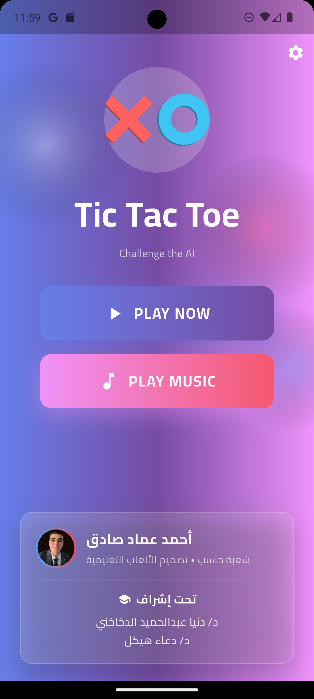
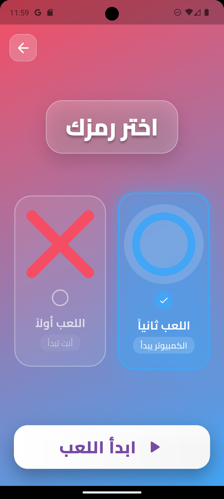
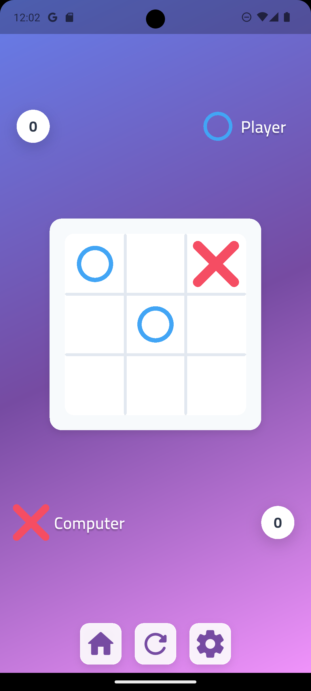
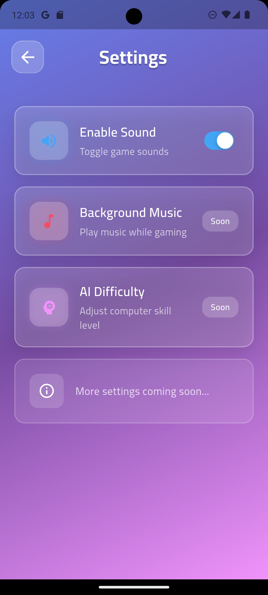

<div align="center">


# ❌ تيك تاك تو ⭕
### لعبة تعليمية تفاعلية مطوَّرة بـ Flutter

<br/>


<br/>

> **مشروع تخرج** — مقرر تصميم الألعاب التعليمية  
> كلية التربية النوعية · قسم الحاسب الآلي

---

</div>

## 📖 نظرة عامة

**تيك تاك تو** هي لعبة تعليمية تفاعلية كلاسيكية (X و O) مبنية بالكامل باستخدام إطار عمل **Flutter**، تُقدِّم تجربة سلسة وممتعة للمستخدم مع دعم ذكاء اصطناعي قابل للتطوير، وحفظ تلقائي للإحصائيات، وواجهة مرئية احترافية.

صُمِّم هذا المشروع ليُجسِّد المفاهيم الأساسية لتصميم الألعاب التعليمية: **التحدي التدريجي**، **التغذية الراجعة الفورية**، و**التحفيز المستمر**.

---

## ✨ المميزات

| الميزة | التفاصيل |
|--------|----------|
| 🤖 **ذكاء اصطناعي** | استراتيجيات متعددة قابلة للتعديل عبر `engines/` |
| 🎚️ **مستويات الصعوبة** | سهل / متوسط / صعب لتناسب جميع الفئات العمرية |
| 💾 **حفظ البيانات** | الإعدادات والإحصائيات محفوظة بين الجلسات |
| 🎵 **مؤثرات صوتية** | أصوات تفاعلية تعزز تجربة اللعب |
| 📜 **سجل التحركات** | مراجعة كاملة لخطوات كل جولة |
| 📱 **تصميم متجاوب** | يعمل على الهواتف وأجهزة سطح المكتب |
| 🏆 **نظام نقاط** | تتبع الانتصارات والإحصائيات الشخصية |

---

## 📸 لقطات الشاشة

<div align="center">

| شاشة البداية | الصفحة الرئيسية | اختيار الحرف |
|:---:|:---:|:---:|
|  |  |  |
| **Splash Screen** | **Home Screen** | **Character Picker** |

| لوح اللعب | نافذة التهنئة | الإعدادات |
|:---:|:---:|:---:|
|  |  |  |
| **Game Board** | **Win Dialog** | **Settings** |

</div>

---

## 🚀 كيفية التشغيل

### المتطلبات الأساسية
- [Flutter SDK](https://flutter.dev/docs/get-started/install) (النسخة 3.x أو أحدث)
- Dart (مدمج مع Flutter)
- محاكي Android / جهاز حقيقي / سطح المكتب

### خطوات التشغيل

```bash
# 1. استنساخ المشروع
git clone https://github.com/YOUR_USERNAME/tictactoe-flutter.git
cd tictactoe-flutter

# 2. تحميل الحزم
flutter pub get

# 3. تشغيل التطبيق
flutter run
```

### بناء نسخة الإصدار (APK)

```bash
flutter build apk --release
```

> ستجد ملف الـ APK في المسار:  
> `build/app/outputs/flutter-apk/app-release.apk`

---

## 🗂️ هيكل المشروع

```
tictactoe-flutter/
│
├── lib/
│   ├── main.dart                  ← نقطة الدخول الرئيسية
│   ├── components/                ← مكونات الواجهة (Widgets)
│   │   ├── board_widget.dart
│   │   ├── cell_widget.dart
│   │   └── result_dialog.dart
│   └── services/                  ← خدمات الصوت والحالة
│       ├── audio_service.dart
│       └── game_state_service.dart
│
├── engines/
│   └── game_engine.dart           ← منطق الذكاء الاصطناعي والقواعد
│
├── images/
│   └── screenshots/               ← لقطات الشاشة
│
└── pubspec.yaml                   ← إعدادات الحزم والأصول
```

---

## 🧠 كيف يعمل الذكاء الاصطناعي؟

يعتمد المحرك في `engines/game_engine.dart` على ثلاث طبقات من الذكاء:

1. **المستوى السهل** — يختار خطوة عشوائية
2. **المستوى المتوسط** — يمنع الفوز المباشر للاعب ويحاول الفوز عند الفرصة
3. **المستوى الصعب** — يستخدم خوارزمية **Minimax** لاتخاذ أفضل قرار ممكن في كل حالة

---

## 🎓 السياق الأكاديمي

<div align="center">

| | |
|---|---|
| 🏛️ **الجامعة** | كلية التربية النوعية |
| 🖥️ **القسم** | قسم الحاسب الآلي |
| 📚 **المقرر** | تصميم الألعاب التعليمية |
| 📅 **العام الدراسي** | 2024 / 2025 |

</div>

---

## 👨‍💻 فريق العمل

<div align="center">

### المطوِّر
**أحمد عماد**

### إشراف أكاديمي
| المشرف | |
|--------|--|
| **د. دنيا عبد الحميد** | مشرف أول |
| **د. دعاء هيكل** | مشرف مشارك |

</div>

---

## 📄 الترخيص

هذا المشروع مُعدّ لأغراض **تعليمية وأكاديمية** بحتة.  
جميع الحقوق محفوظة © 2025 — **أحمد عماد**

---

<div align="center">

**كلية التربية النوعية · قسم الحاسب الآلي**

</div>